# Work Breakdown Structure (WBS)

## OpenAI Enterprise Billing System — CST2310

**Version:** 1.0
**Date:** 9 March 2026
**Methodology:** Unified Process

---

## WBS Hierarchy Diagram

```mermaid
graph TD
    ROOT["1.0 OpenAI Enterprise<br>Billing System Analysis"]

    ROOT --> PM["1.1 Project<br>Management"]
    ROOT --> CS["1.2 Case Study<br>Analysis"]
    ROOT --> UML["1.3 UML Schematic<br>Models"]
    ROOT --> UI["1.4 User Interface<br>Design"]
    ROOT --> LE["1.5 Law and<br>Ethics"]
    ROOT --> RP["1.6 Report<br>Production"]
    ROOT --> PR["1.7 Presentation"]

    PM --> PM1["1.1.1 Activity List"]
    PM --> PM2["1.1.2 WBS"]
    PM --> PM3["1.1.3 Gantt Chart"]
    PM --> PM4["1.1.4 Risk Matrix"]
    PM --> PM5["1.1.5 Critical Path"]
    PM --> PM6["1.1.6 Meeting Minutes"]
    PM --> PM7["1.1.7 Self/Peer Assessment"]

    CS --> CS1["1.2.1 Narrative"]
    CS --> CS2["1.2.2 Business Case"]
    CS --> CS3["1.2.3 Functional Reqs"]
    CS --> CS4["1.2.4 Non-Functional Reqs"]
    CS --> CS5["1.2.5 System Actors"]
    CS --> CS6["1.2.6 Data Collection"]

    UML --> UML1["1.3.1 Use Case Diagrams"]
    UML --> UML2["1.3.2 Use Case Descriptors"]
    UML --> UML3["1.3.3 Class Diagram"]
    UML --> UML4["1.3.4 ERD"]
    UML --> UML5["1.3.5 Activity Diagrams"]
    UML --> UML6["1.3.6 Sequence Diagrams"]
    UML --> UML7["1.3.7 Collaboration Diagrams"]

    UI --> UI1["1.4.1–1.4.6 Six UI Designs"]
    UI --> UI2["1.4.7 Nielsen's Heuristics"]

    LE --> LE1["1.5.1 GDPR Analysis"]
    LE --> LE2["1.5.2 Security Analysis"]
    LE --> LE3["1.5.3 Equality Analysis"]

    RP --> RP1["1.6.1–1.6.7 Chapters"]
    RP --> RP2["1.6.10 Peer Review"]
    RP --> RP3["1.6.11 Formatting & TOC"]

    PR --> PR1["1.7.1 Slide Design"]
    PR --> PR2["1.7.2 Visual Aids"]
    PR --> PR3["1.7.3 Rehearsal"]
    PR --> PR4["1.7.4 Final Delivery"]

    style ROOT fill:#2c3e50,color:#fff
    style PM fill:#e74c3c,color:#fff
    style CS fill:#e67e22,color:#fff
    style UML fill:#2ecc71,color:#fff
    style UI fill:#3498db,color:#fff
    style LE fill:#9b59b6,color:#fff
    style RP fill:#1abc9c,color:#fff
    style PR fill:#f39c12,color:#fff
```



---

## Indented List Format

```
1.0  OPENAI ENTERPRISE BILLING SYSTEM ANALYSIS
│
├── 1.1  PROJECT MANAGEMENT
│   ├── 1.1.1  Activity List
│   ├── 1.1.2  Work Breakdown Structure (WBS)
│   ├── 1.1.3  Gantt Chart
│   ├── 1.1.4  Risk Matrix (9–10 risks with mitigation and contingency)
│   ├── 1.1.5  Critical Path Analysis
│   ├── 1.1.6  Weekly Meeting Minutes (Weeks 7–12)
│   └── 1.1.7  Self-Assessment and Peer Assessment
│
├── 1.2  CASE STUDY ANALYSIS
│   ├── 1.2.1  Case Study Narrative
│   │   ├── 1.2.1.1  Background and market context
│   │   ├── 1.2.1.2  Current system problems
│   │   ├── 1.2.1.3  Proposed system description
│   │   └── 1.2.1.4  Information system classification (BIS/TPS/MIS)
│   │
│   ├── 1.2.2  Business Case
│   │   ├── 1.2.2.1  Problem statement
│   │   ├── 1.2.2.2  Proposed solution
│   │   ├── 1.2.2.3  Benefits analysis (tangible and intangible)
│   │   ├── 1.2.2.4  Cost and ROI estimation
│   │   └── 1.2.2.5  Success criteria and KPIs
│   │
│   ├── 1.2.3  Functional Requirements Specification
│   │   ├── 1.2.3.1  User management requirements
│   │   ├── 1.2.3.2  Billing and usage tracking requirements
│   │   ├── 1.2.3.3  API key management requirements
│   │   ├── 1.2.3.4  Alerting and notification requirements
│   │   ├── 1.2.3.5  Reporting and audit requirements
│   │   └── 1.2.3.6  Settings and configuration requirements
│   │
│   ├── 1.2.4  Non-Functional Requirements Specification
│   │   ├── 1.2.4.1  Performance requirements
│   │   ├── 1.2.4.2  Security requirements
│   │   ├── 1.2.4.3  Usability requirements
│   │   ├── 1.2.4.4  Reliability and availability requirements
│   │   ├── 1.2.4.5  Scalability requirements
│   │   └── 1.2.4.6  Compliance requirements (GDPR, audit)
│   │
│   ├── 1.2.5  System Actors Definition
│   │   ├── 1.2.5.1  Administrator
│   │   ├── 1.2.5.2  Department Manager
│   │   ├── 1.2.5.3  Finance Officer
│   │   ├── 1.2.5.4  Developer
│   │   ├── 1.2.5.5  Auditor
│   │   └── 1.2.5.6  System (automated actor)
│   │
│   └── 1.2.6  Data Collection Methods
│       ├── 1.2.6.1  Interviews
│       ├── 1.2.6.2  Questionnaires
│       ├── 1.2.6.3  Observation
│       ├── 1.2.6.4  Document analysis
│       └── 1.2.6.5  Prototyping
│
├── 1.3  UML SCHEMATIC MODELS
│   ├── 1.3.1  Use Case Diagrams (4–6 diagrams)
│   │   ├── 1.3.1.1  UCD: Billing and Usage Management
│   │   ├── 1.3.1.2  UCD: API Key Lifecycle Management
│   │   ├── 1.3.1.3  UCD: Alert and Notification System
│   │   ├── 1.3.1.4  UCD: Reporting and Audit Compliance
│   │   ├── 1.3.1.5  UCD: Department and Project Management
│   │   └── 1.3.1.6  UCD: System Administration and Settings
│   │
│   ├── 1.3.2  Use Case Descriptors (4–6 descriptors)
│   │   ├── 1.3.2.1  UC: Record API Usage
│   │   ├── 1.3.2.2  UC: Manage Department Budget
│   │   ├── 1.3.2.3  UC: Rotate API Key
│   │   ├── 1.3.2.4  UC: Configure Quota Alert
│   │   ├── 1.3.2.5  UC: Generate Compliance Report
│   │   └── 1.3.2.6  UC: Acknowledge Security Alert
│   │
│   ├── 1.3.3  Class Diagram
│   │   ├── 1.3.3.1  Entity classes with attributes and methods
│   │   ├── 1.3.3.2  Relationships (association, aggregation, composition, inheritance)
│   │   └── 1.3.3.3  Multiplicity notation
│   │
│   ├── 1.3.4  Entity-Relationship Diagram (ERD)
│   │   ├── 1.3.4.1  Entity identification
│   │   ├── 1.3.4.2  Primary and foreign key mapping
│   │   └── 1.3.4.3  Relationship cardinalities
│   │
│   ├── 1.3.5  Activity Diagrams (4–6 diagrams)
│   │   ├── 1.3.5.1  AD: API Usage Recording and Billing
│   │   ├── 1.3.5.2  AD: API Key Rotation Workflow
│   │   ├── 1.3.5.3  AD: Budget Overspend Alert Handling
│   │   ├── 1.3.5.4  AD: Monthly Compliance Audit
│   │   ├── 1.3.5.5  AD: Department Onboarding
│   │   └── 1.3.5.6  AD: Anomaly Detection and Response
│   │
│   ├── 1.3.6  Sequence Diagrams (4–6 diagrams)
│   │   ├── 1.3.6.1  SD: API Call → Usage Recorded → Budget Checked
│   │   ├── 1.3.6.2  SD: Monthly Report Generation
│   │   ├── 1.3.6.3  SD: Compromised API Key Rotation
│   │   ├── 1.3.6.4  SD: Quota Threshold Alert Cycle
│   │   ├── 1.3.6.5  SD: Audit Trail Review
│   │   └── 1.3.6.6  SD: Department Budget Update
│   │
│   └── 1.3.7  Collaboration Diagrams (4–6 diagrams)
│       ├── 1.3.7.1  CD: Corresponding to SD 1
│       ├── 1.3.7.2  CD: Corresponding to SD 2
│       ├── 1.3.7.3  CD: Corresponding to SD 3
│       ├── 1.3.7.4  CD: Corresponding to SD 4
│       ├── 1.3.7.5  CD: Corresponding to SD 5
│       └── 1.3.7.6  CD: Corresponding to SD 6
│
├── 1.4  USER INTERFACE DESIGN
│   ├── 1.4.1  UI: Dashboard Overview
│   ├── 1.4.2  UI: Department Budget Management
│   ├── 1.4.3  UI: API Key Management Console
│   ├── 1.4.4  UI: Alert Centre
│   ├── 1.4.5  UI: Usage Analytics Report
│   ├── 1.4.6  UI: Audit Trail Viewer
│   └── 1.4.7  Nielsen's Heuristics Evaluation (per UI)
│
├── 1.5  LAW AND ETHICS
│   ├── 1.5.1  GDPR Compliance Analysis
│   │   ├── 1.5.1.1  Data subjects and personal data identification
│   │   ├── 1.5.1.2  Lawful basis for processing
│   │   ├── 1.5.1.3  Data protection principles
│   │   ├── 1.5.1.4  Data subject rights
│   │   └── 1.5.1.5  DPIA and breach notification
│   │
│   ├── 1.5.2  Information Security Analysis
│   │   ├── 1.5.2.1  CIA triad application
│   │   ├── 1.5.2.2  Authentication and authorisation design
│   │   ├── 1.5.2.3  Encryption and audit logging
│   │   └── 1.5.2.4  Incident response plan
│   │
│   └── 1.5.3  Equality and Accessibility Analysis
│       ├── 1.5.3.1  Equality Act 2010 compliance
│       ├── 1.5.3.2  WCAG 2.1 AA standards
│       └── 1.5.3.3  Digital inclusion considerations
│
├── 1.6  REPORT PRODUCTION
│   ├── 1.6.1  Introduction (BIS/TPS/MIS definitions)
│   ├── 1.6.2  Project Management Chapter
│   ├── 1.6.3  Case Study Chapter
│   ├── 1.6.4  UML Models Chapter
│   ├── 1.6.5  User Interface Design Chapter
│   ├── 1.6.6  Law and Ethics Chapter
│   ├── 1.6.7  Conclusions
│   ├── 1.6.8  References (Harvard format)
│   ├── 1.6.9  Appendix (minutes, self-assessment, peer assessment)
│   ├── 1.6.10 Peer Review of All Sections
│   └── 1.6.11 Formatting, TOC, and Final Proofread
│
└── 1.7  PRESENTATION
    ├── 1.7.1  Slide Design and Section Allocation
    ├── 1.7.2  Visual Aids (UML diagrams, UI mockups, charts)
    ├── 1.7.3  Rehearsal (timed)
    └── 1.7.4  Final Delivery (Week 12)
```

---

## WBS Dictionary (Key Work Packages)

| WBS Code | Work Package | Description | Owner | Target |
|---|---|---|---|---|
| 1.1.1 | Activity List | Comprehensive task list with durations and dependencies | Afsah | Week 7 |
| 1.1.2 | WBS | This document; hierarchical deliverables breakdown | Syed | Week 7 |
| 1.1.3 | Gantt Chart | Scheduled timeline with dependencies and milestones | Afsah | Week 8 |
| 1.1.4 | Risk Matrix | 9–10 risks with mitigations and contingency plans | Jake | Week 8 |
| 1.1.5 | Critical Path | Zero-float activity analysis with slack calculations | Afsah | Week 8 |
| 1.2.1 | Case Study Narrative | System background, problems, proposed solution, BIS classification | Afsah | Week 8 |
| 1.2.2 | Business Case | Problem, solution, benefits, costs, ROI, KPIs | Syed | Week 8 |
| 1.2.3 | Functional Requirements | 15–20 FRs with MoSCoW prioritisation | Jake | Week 9 |
| 1.2.4 | Non-Functional Requirements | 10–15 NFRs across quality categories | Eeshitha | Week 9 |
| 1.2.6 | Data Collection Methods | 4–5 elicitation techniques documented | Syed | Week 9 |
| 1.3.1 | Use Case Diagrams | 4–6 UCDs with actors and relationships | Jake | Week 10 |
| 1.3.2 | Use Case Descriptors | 4–6 fully dressed descriptors | Syed | Week 10 |
| 1.3.3–4 | Class Diagram + ERD | Complete domain model with ERD | Syed | Week 10 |
| 1.3.5 | Activity Diagrams | 4–6 ADs with swim lanes | Jake | Week 11 |
| 1.3.6 | Sequence Diagrams | 4–6 SDs with fragments | Eeshitha | Week 11 |
| 1.3.7 | Collaboration Diagrams | 4–6 CDs corresponding to SDs | Eeshitha | Week 11 |
| 1.4 | User Interface Designs | 4–6 UIs with Nielsen's Heuristics | Afsah | Week 11 |
| 1.5 | Law and Ethics | GDPR, security, equality analysis | All | Week 11 |
| 1.6 | Report Production | All chapters assembled, reviewed, formatted | All | Week 12 |
| 1.7 | Presentation | Slides, rehearsal, delivery | All | Week 12 |

---

## Notes

- This WBS follows the **deliverables-based** approach: every item is a product/document (noun), not an activity (verb)
- The **100% Rule** is satisfied: the sum of all Level 2 items captures all project work
- The WBS is the basis for the Gantt Chart (all Level 3+ items appear as Gantt tasks) and the Activity List
- A **tree diagram** version of this WBS should be produced for visual inclusion in the report and presentation slides
