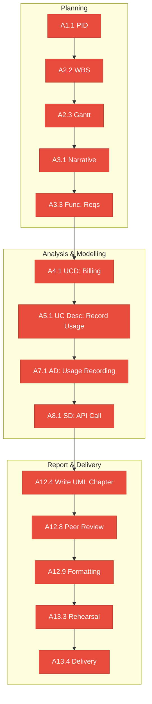
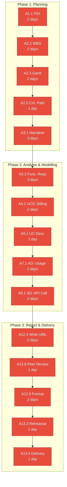

# Critical Path Analysis

## OpenAI Enterprise Billing System — CST2310

**Version:** 1.0
**Date:** 16 March 2026

---

## Critical Path

The critical path is the longest sequence of dependent activities that determines the minimum project duration. Any delay to a critical-path activity directly delays the submission date.

---

## Activity Network Table

| Activity | Description | Duration (days) | ES | EF | LS | LF | Float | Critical? |
|---|---|---|---|---|---|---|---|---|
| A1.1 | Draft PID | 2 | 1 | 2 | 1 | 2 | 0 | **Yes** |
| A1.2 | Define team roles | 1 | 1 | 1 | 2 | 2 | 1 | No |
| A2.1 | Activity List | 1 | 1 | 1 | 1 | 1 | 0 | **Yes** |
| A2.2 | WBS | 2 | 2 | 3 | 2 | 3 | 0 | **Yes** |
| A2.3 | Gantt Chart | 2 | 3 | 4 | 3 | 4 | 0 | **Yes** |
| A2.4 | Risk Matrix | 2 | 3 | 4 | 4 | 5 | 1 | No |
| A2.5 | Critical Path | 1 | 5 | 5 | 5 | 5 | 0 | **Yes** |
| A3.1 | Case study narrative | 3 | 3 | 5 | 3 | 5 | 0 | **Yes** |
| A3.2 | Business case | 3 | 6 | 8 | 7 | 9 | 1 | No |
| A3.6 | System actors | 1 | 5 | 5 | 6 | 6 | 1 | No |
| A3.3 | Functional requirements | 3 | 6 | 8 | 6 | 8 | 0 | **Yes** |
| A3.4 | Non-functional requirements | 2 | 8 | 9 | 9 | 10 | 1 | No |
| A3.5 | Data collection methods | 2 | 9 | 10 | 11 | 12 | 2 | No |
| A4.1 | UCD: Billing and Usage | 2 | 9 | 10 | 9 | 10 | 0 | **Yes** |
| A4.2 | UCD: API Key Lifecycle | 2 | 9 | 10 | 10 | 11 | 1 | No |
| A4.3 | UCD: Alert System | 2 | 10 | 11 | 10 | 11 | 0 | No |
| A4.4 | UCD: Reporting & Audit | 2 | 10 | 11 | 11 | 12 | 1 | No |
| A4.5 | UCD: Dept & Project Mgmt | 2 | 11 | 12 | 12 | 13 | 1 | No |
| A4.6 | UCD: System Admin | 2 | 12 | 13 | 13 | 14 | 1 | No |
| A5.1 | UC Desc: Record API Usage | 1 | 11 | 11 | 11 | 11 | 0 | **Yes** |
| A5.2 | UC Desc: Manage Budget | 1 | 13 | 13 | 14 | 14 | 1 | No |
| A5.3 | UC Desc: Rotate API Key | 1 | 11 | 11 | 12 | 12 | 1 | No |
| A5.4 | UC Desc: Configure Alert | 1 | 12 | 12 | 13 | 13 | 1 | No |
| A5.5 | UC Desc: Generate Report | 1 | 12 | 12 | 14 | 14 | 2 | No |
| A5.6 | UC Desc: Ack Security Alert | 1 | 12 | 12 | 14 | 14 | 2 | No |
| A6.1 | Class diagram | 3 | 9 | 11 | 11 | 13 | 2 | No |
| A6.2 | ERD | 2 | 12 | 13 | 14 | 15 | 2 | No |
| A7.1 | AD: Usage Recording | 2 | 12 | 13 | 12 | 13 | 0 | **Yes** |
| A7.2 | AD: Key Rotation | 2 | 12 | 13 | 13 | 14 | 1 | No |
| A7.3 | AD: Budget Alert | 2 | 13 | 14 | 14 | 15 | 1 | No |
| A8.1 | SD: API Call | 2 | 14 | 15 | 14 | 15 | 0 | **Yes** |
| A8.2 | SD: Monthly Report | 3 | 13 | 15 | 14 | 16 | 1 | No |
| A8.3 | SD: Key Rotation | 2 | 14 | 15 | 15 | 16 | 1 | No |
| A9.1 | Collaboration diagrams | 3 | 16 | 18 | 17 | 19 | 1 | No |
| A12.4 | Write UML chapter | 2 | 19 | 20 | 19 | 20 | 0 | **Yes** |
| A12.8 | Peer review | 1 | 22 | 22 | 22 | 22 | 0 | **Yes** |
| A12.9 | Formatting & proofread | 2 | 23 | 24 | 23 | 24 | 0 | **Yes** |
| A13.1 | Design slides | 1 | 22 | 22 | 23 | 23 | 1 | No |
| A13.3 | Rehearsal | 1 | 24 | 24 | 24 | 24 | 0 | **Yes** |
| A13.4 | Delivery | 1 | 25 | 25 | 25 | 25 | 0 | **Yes** |

---

## Critical Path Diagram

---

## Implications

1. **UML diagrams are the bottleneck.** The chain from functional requirements through use case diagrams, descriptors, activity diagrams, and sequence diagrams forms the longest path. Any delay in completing diagrams cascades to the report and presentation.

2. **Parallel work opportunities exist.** Non-critical activities (business case, non-functional requirements, law & ethics, class diagram/ERD) can be worked on in parallel without affecting the deadline.

3. **Float management.** Activities with float > 0 can slip by that many days without delaying the project. However, consuming all float converts an activity to the critical path.

4. **Risk mitigation.** The highest-risk activities are those on the critical path with external dependencies (e.g., A4.1 depends on A3.3 — if functional requirements are delayed, all UML work is blocked).

---

## Notes

- ES = Earliest Start, EF = Earliest Finish, LS = Latest Start, LF = Latest Finish
- Float = LS − ES (or LF − EF)
- Day numbers are relative to project start (Day 1 = first day of Week 7)
- Activities with Float = 0 are on the critical path
- This analysis should be updated if the plan changes during the project
