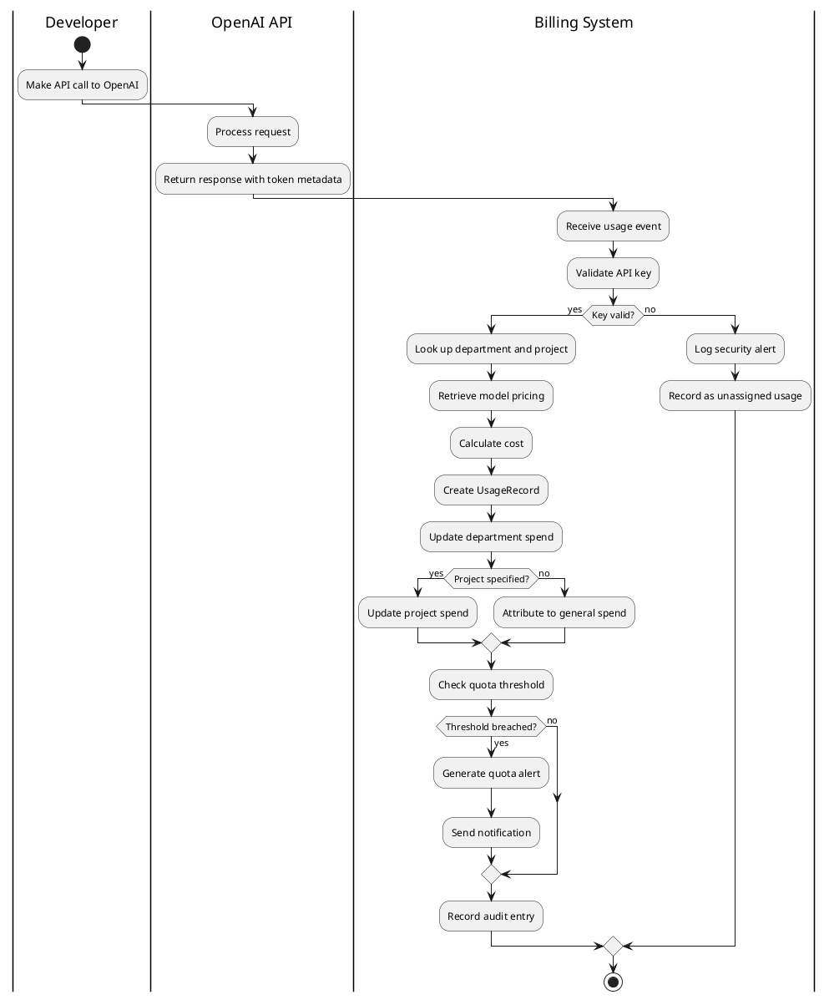
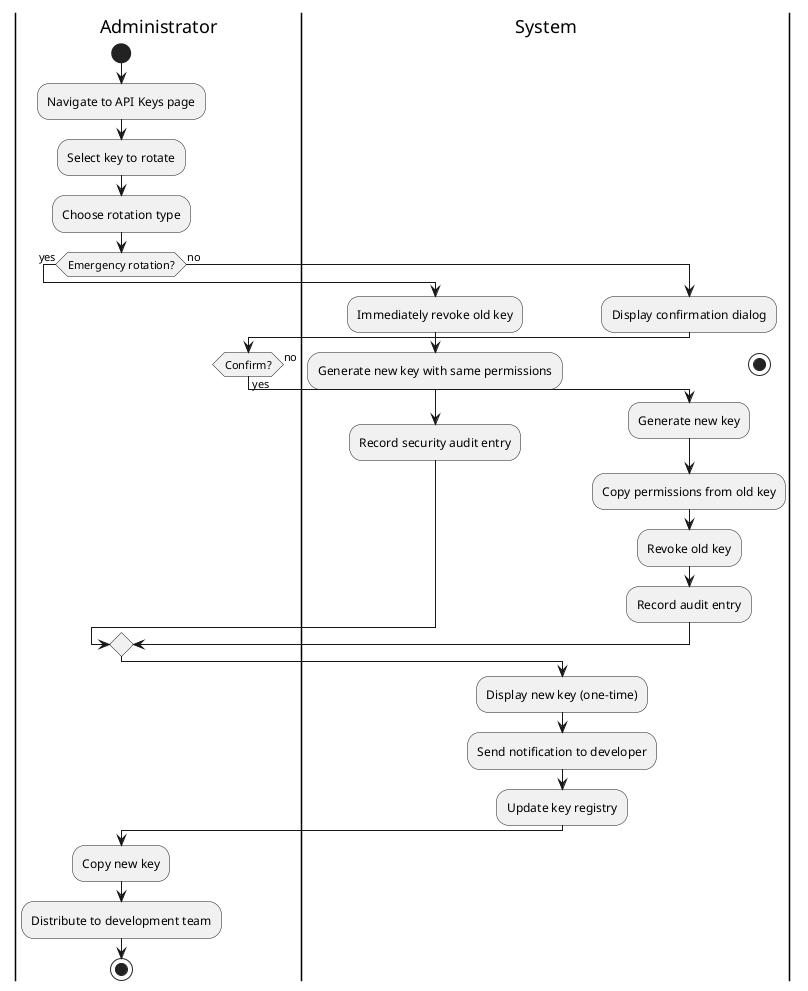
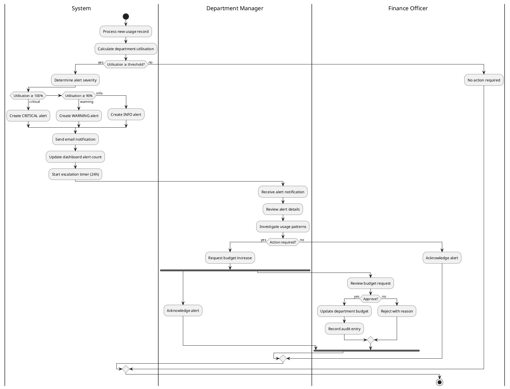
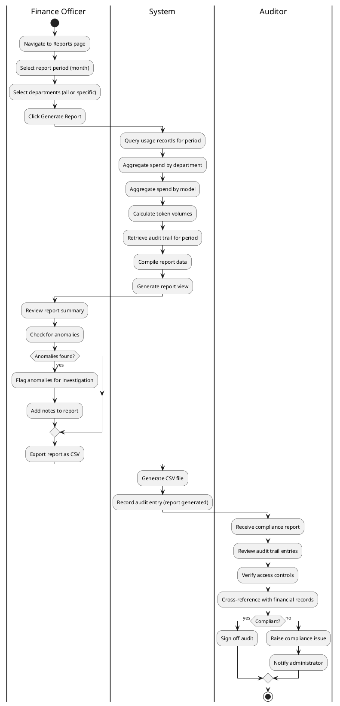
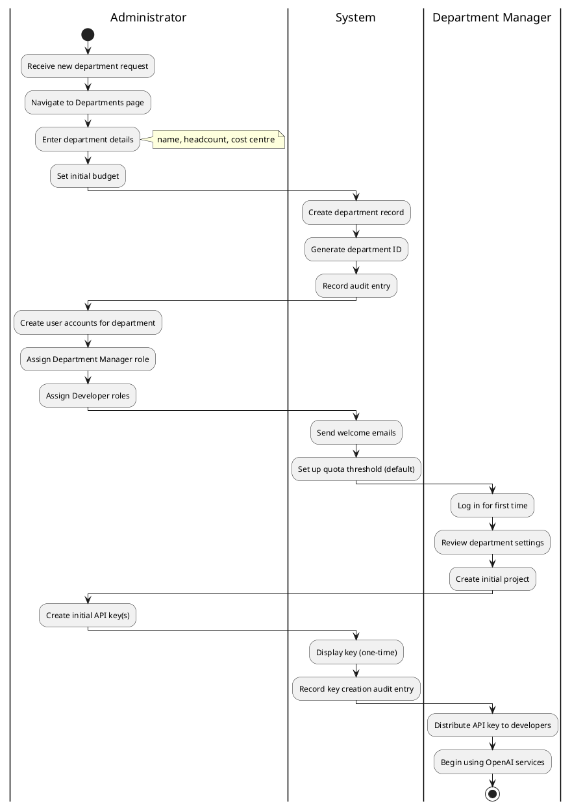
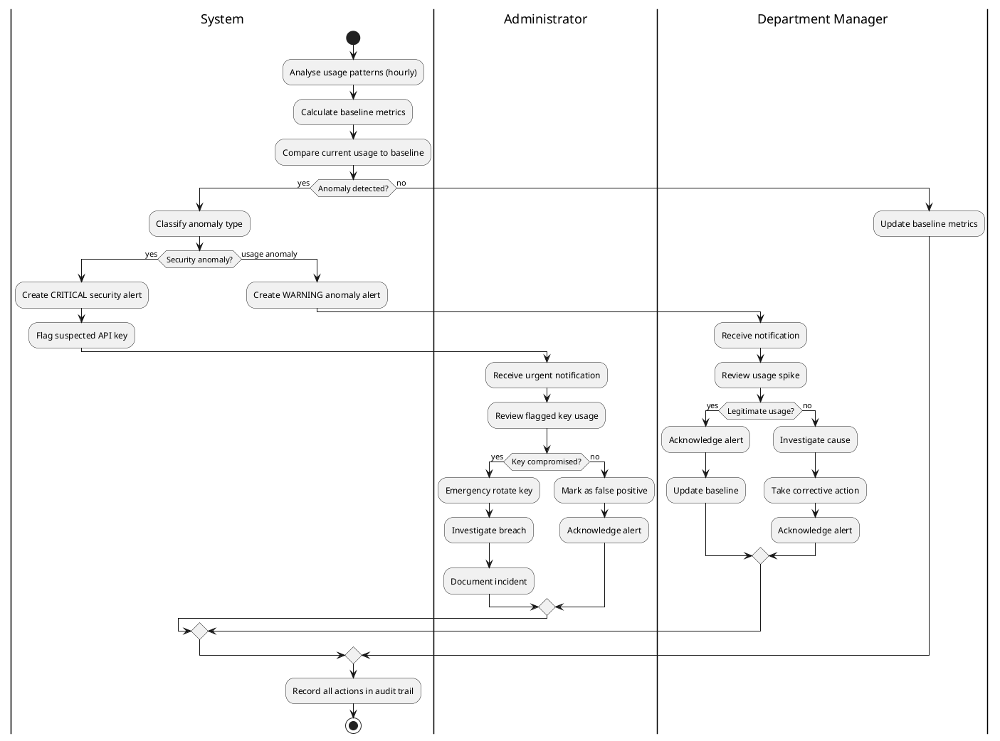

# Activity Diagrams

## OpenAI Enterprise Billing System — CST2310

---

## 1. API Usage Recording and Billing Process

**Description:** This activity diagram traces the end-to-end flow from a developer making an API call through to the billing system recording the usage, calculating costs, updating department and project spend, and checking quota thresholds. The swim lanes separate responsibilities across the Developer, OpenAI API, and the Billing System.

---

## 2. API Key Rotation Workflow

**Description:** This diagram shows the API key rotation workflow with a decision point for emergency vs. standard rotation. Emergency rotations bypass the confirmation step. Both paths converge at key generation and notification.

---

## 3. Budget Overspend Alert Handling

**Description:** This diagram models the complete alert handling flow from detection through resolution. The System determines severity based on utilisation percentage. The Department Manager investigates and may acknowledge the alert or request a budget increase, which the Finance Officer must approve.

---

## 4. Monthly Compliance Audit Process

**Description:** This diagram shows the monthly audit process spanning Finance Officer, System, and Auditor. The Finance Officer generates the report, reviews for anomalies, and exports it. The Auditor then conducts a compliance review against the audit trail.

---

## 5. Department Onboarding Process

**Description:** This diagram models the onboarding of a new department, from initial request through department creation, user account setup, project creation, and API key provisioning.

---

## 6. Anomaly Detection and Response

**Description:** This diagram shows the automated anomaly detection process, distinguishing between security anomalies (potential key compromise, handled by Administrator) and usage anomalies (unexpected spending patterns, handled by Department Manager). Both paths include investigation, response, and audit trail recording.
