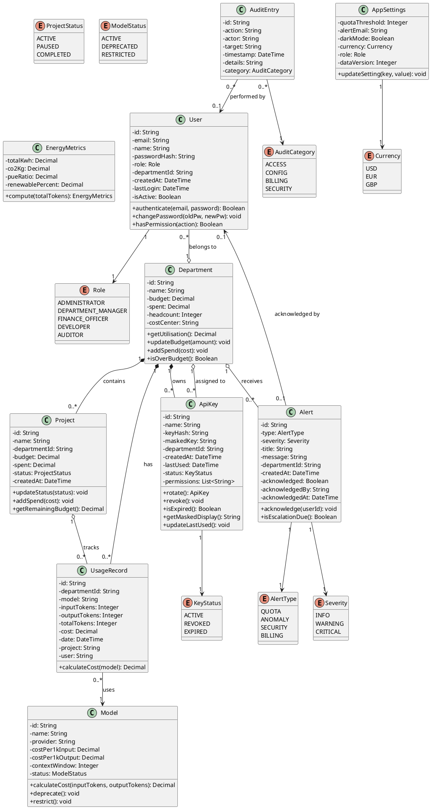
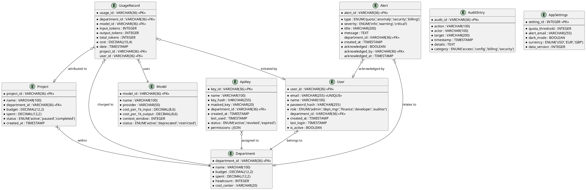

# Class Diagram and Entity-Relationship Diagram

## OpenAI Enterprise Billing System — CST2310

---

## Class Diagram

### Class Diagram Description

The class diagram models the core domain of the OpenAI Enterprise Billing system:

- **User** is the central actor entity, associated with a Role (enumeration) and optionally belonging to a Department (aggregation)
- **Department** is a composition parent for Projects, UsageRecords, and ApiKeys — when a department is deleted, its children are also removed
- **Project** tracks spend within a department and has a lifecycle status
- **UsageRecord** represents a single API usage event, associated with a Model for cost calculation
- **ApiKey** manages the credential lifecycle with statuses and permissions
- **Alert** is generated by the system and received by departments, with an acknowledgement workflow
- **AuditEntry** provides an immutable record of all significant system actions
- **EnergyMetrics** is a computed value object derived from total token usage

---

## Entity-Relationship Diagram (ERD)

### ERD Description

The ERD maps the domain model to a relational database schema:

- **Primary keys** use UUID (VARCHAR(36)) for all entities
- **Foreign keys** establish referential integrity between entities
- **Department** is the central entity: Users belong to departments, Projects exist within departments, UsageRecords are charged to departments, and ApiKeys are assigned to departments
- **UsageRecord** has foreign keys to Department (mandatory), Model (mandatory), Project (optional), and User (optional)
- **Alert** optionally relates to a Department and tracks acknowledgement by a User
- **AuditEntry** is intentionally denormalised (actor stored as string, not FK) to ensure audit entries remain meaningful even if the referenced user is deactivated
- **AppSettings** is a singleton table with a single row

### Cardinalities

| Relationship | Cardinality | Description |
|---|---|---|
| User → Department | Many-to-One | Many users can belong to one department |
| Department → Project | One-to-Many | A department can have many projects |
| Department → UsageRecord | One-to-Many | A department can have many usage records |
| Department → ApiKey | One-to-Many | A department can have many API keys |
| Model → UsageRecord | One-to-Many | A model can be referenced by many usage records |
| Project → UsageRecord | One-to-Many (optional) | A project can have many usage records; records may not specify a project |
| Department → Alert | One-to-Many (optional) | A department can receive many alerts; some alerts are system-wide |
| User → Alert | One-to-One (optional) | An alert can be acknowledged by one user |
