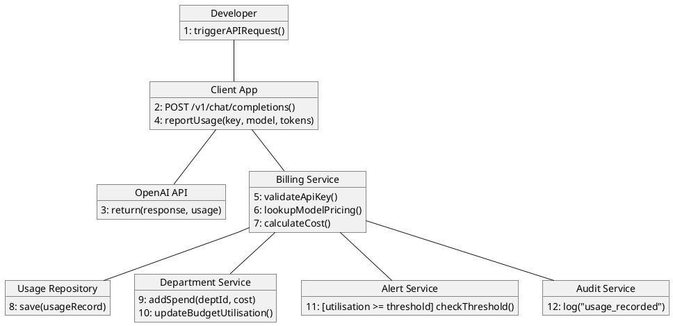
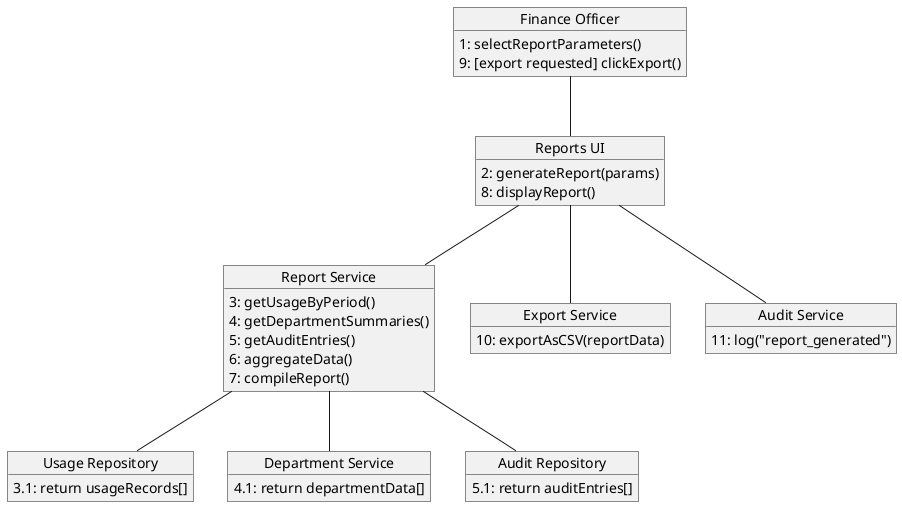
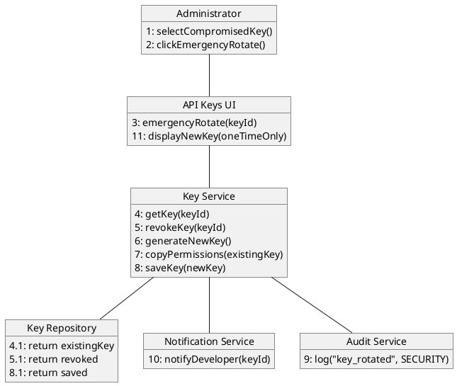
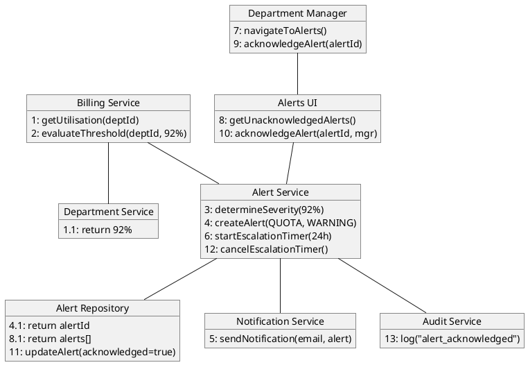
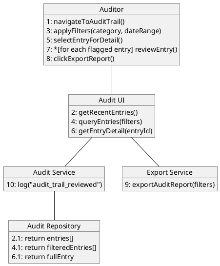
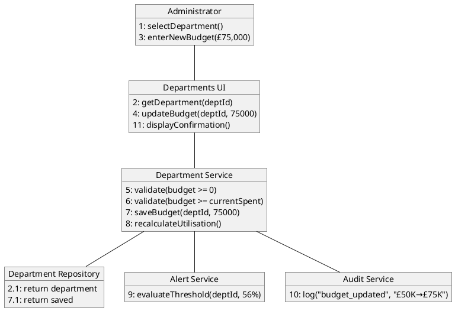

# Collaboration Diagrams

## OpenAI Enterprise Billing System — CST2310

Collaboration diagrams (also called communication diagrams in UML 2.x) re-express the interactions from the sequence diagrams, emphasising the structural relationships between objects rather than temporal ordering. Messages are numbered to indicate sequence.

---

## 1. API Call → Usage Recorded → Budget Checked

**Description:** This collaboration diagram shows the structural relationships between the Developer, Client App, OpenAI API, and the billing system components. The numbered messages indicate the sequence of interactions. Message 11 is conditional (guard: utilisation >= threshold).

---

## 2. Monthly Report Generation

**Description:** The Report Service acts as a coordinator, querying three repositories (Usage, Department, Audit) to compile the report. Nested numbering (3.1, 4.1, 5.1) shows return messages. Message 9 is conditional.

---

## 3. Emergency API Key Rotation

**Description:** The Key Service orchestrates the rotation, interacting with the Key Repository for persistence, the Audit Service for logging, and the Notification Service to inform the affected developer. The UI displays the new key exactly once.

---

## 4. Quota Alert Lifecycle

**Description:** This diagram shows the complete alert lifecycle. The structural links reveal that the Alert Service is the central coordinator, connecting to the repository for persistence, the notification service for delivery, and the audit service for compliance.

---

## 5. Audit Trail Review

**Description:** The Auditor interacts with the system through the Audit UI, which delegates to the Audit Repository for data retrieval. Message 7 uses the iteration marker (*) to indicate repeated review of flagged entries.

---

## 6. Department Budget Update

**Description:** The Department Service validates the budget change (messages 5–6) before persisting it. The Alert Service re-evaluates thresholds against the new budget, and the Audit Service records the change with previous and new values.

---

## Notes on Collaboration Diagrams

- **Numbering convention:** Flat numbering (1, 2, 3...) indicates sequential execution. Nested numbering (3.1) indicates a return message or sub-step
- **Guard conditions** are shown in square brackets: `[condition]`
- **Iteration** is marked with an asterisk: `*[for each item]`
- Each diagram corresponds directly to a sequence diagram above, showing the same interactions from a structural perspective
- Collaboration diagrams are particularly useful for understanding which objects communicate directly with each other, revealing the coupling structure of the system
