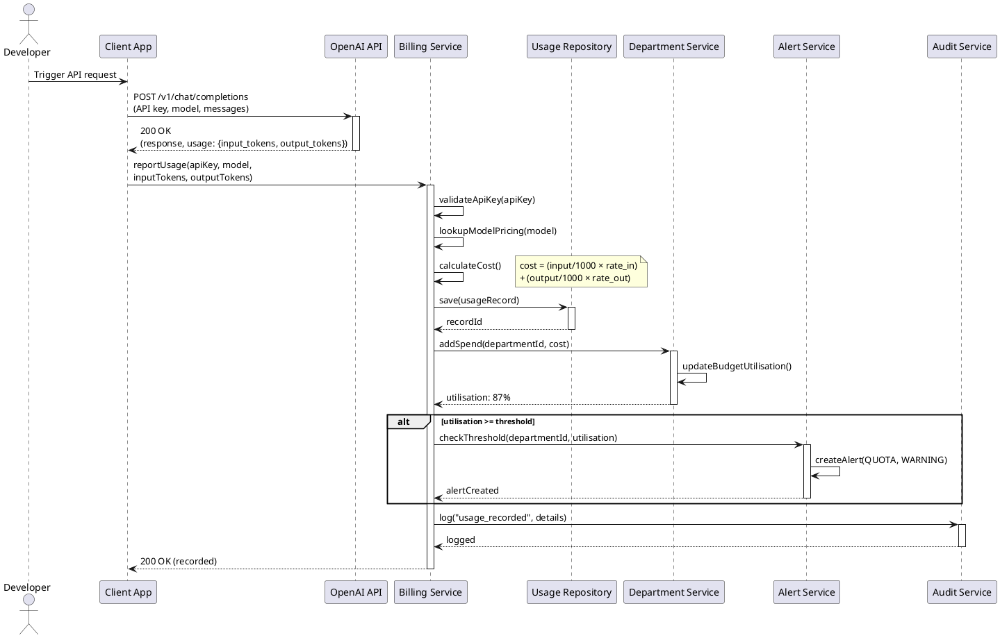
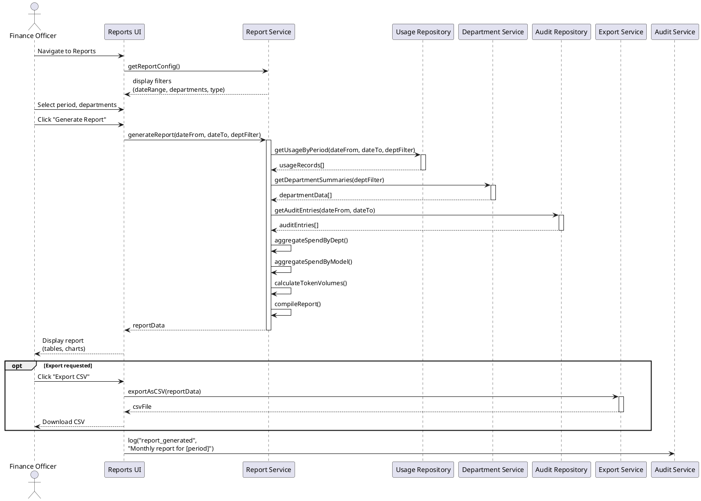
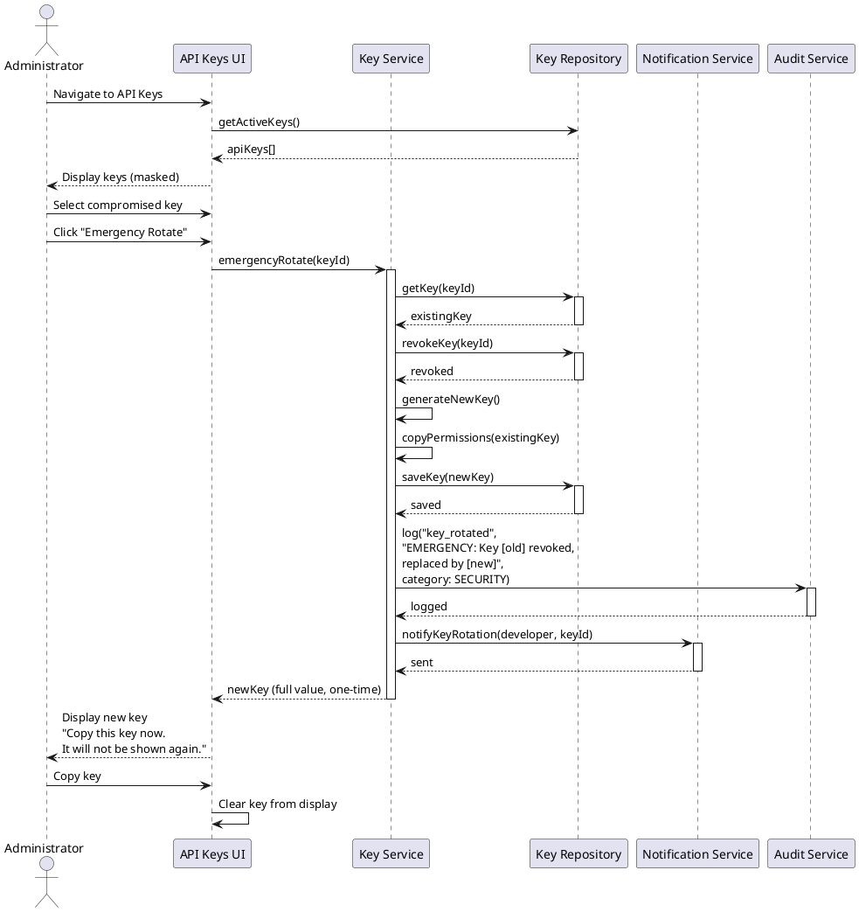
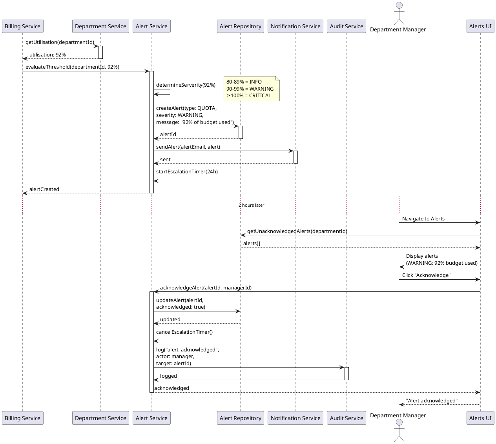
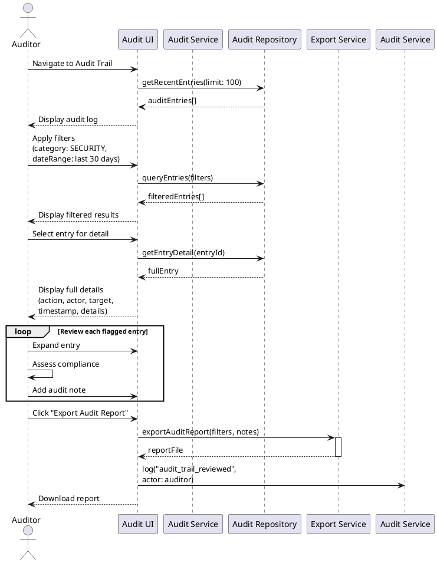
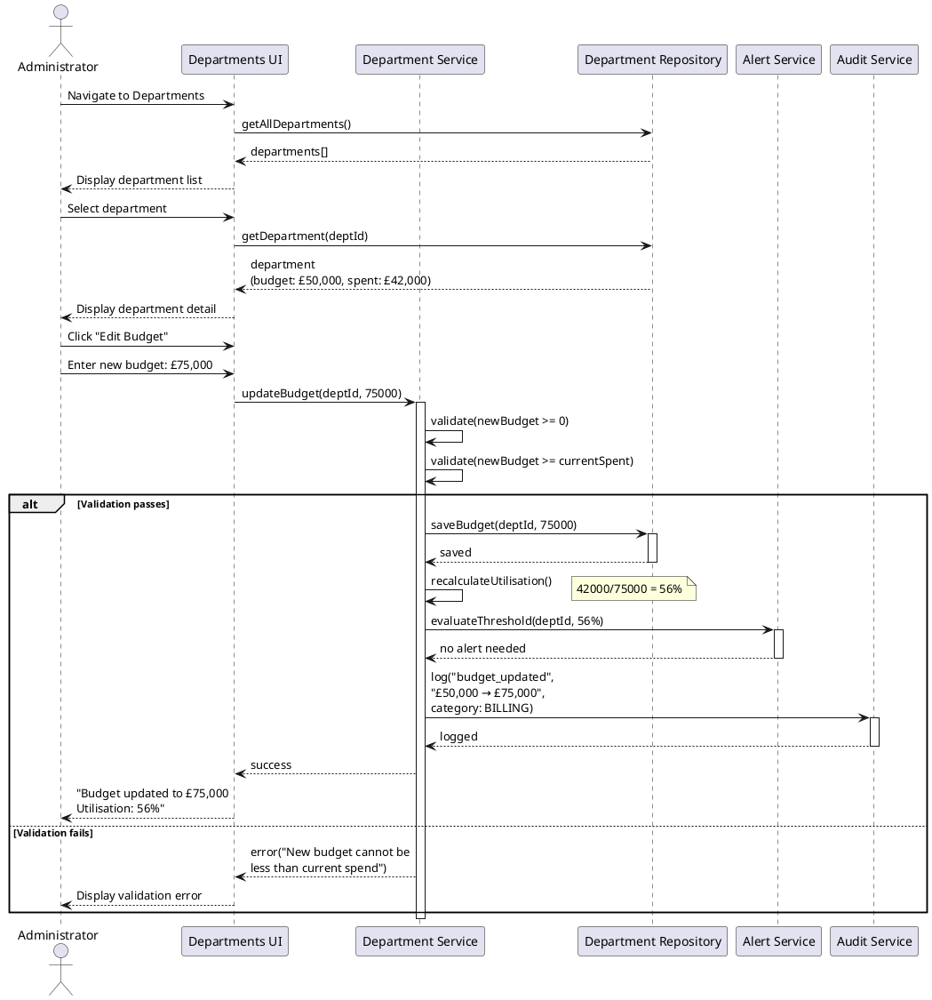

# Sequence Diagrams

## OpenAI Enterprise Billing System — CST2310

---

## 1. API Call → Usage Recorded → Budget Checked

**Description:** This sequence diagram traces the complete flow from a developer's API call through billing, cost calculation, department spend update, and conditional alert generation. The `alt` fragment models the conditional quota threshold check.

---

## 2. Finance Officer Generates Monthly Report

**Description:** The Finance Officer generates a monthly report. The sequence shows data retrieval from multiple repositories, aggregation, and optional CSV export. The `opt` fragment represents the conditional export step.

---

## 3. Administrator Rotates Compromised API Key

**Description:** This diagram models emergency API key rotation. The key is revoked immediately, a new key is generated with the same permissions, and the developer is notified. The full key value is shown once.

---

## 4. System Detects Quota Threshold → Sends Alert → Manager Acknowledges

**Description:** This diagram shows the complete alert lifecycle: the Billing Service detects a threshold breach, the Alert Service generates and sends the alert, and the Department Manager later acknowledges it. The escalation timer is cancelled upon acknowledgement.

---

## 5. Auditor Reviews Audit Trail

**Description:** The Auditor reviews the audit trail by querying, filtering, and examining individual entries. A `loop` fragment models the iterative review of flagged entries. The reviewed data can be exported as an audit report.

---

## 6. Administrator Updates Department Budget

**Description:** The Administrator updates a department's budget. The sequence includes validation (budget cannot be negative or below current spend), utilisation recalculation, threshold re-evaluation, and audit logging. The `alt` fragment handles validation success and failure.
