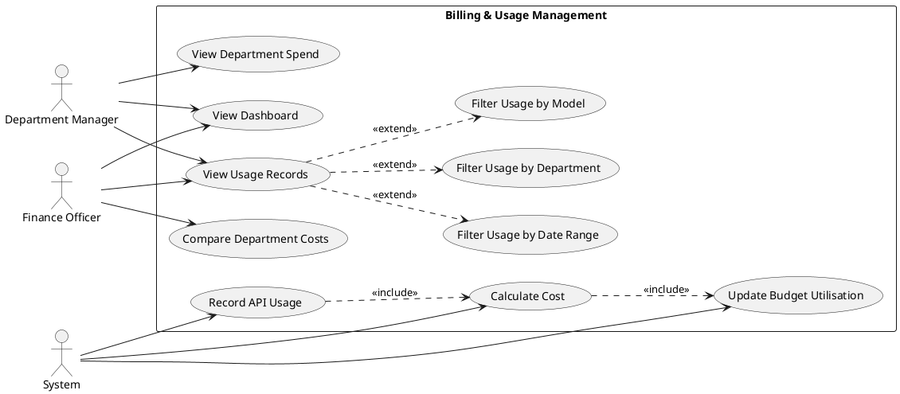
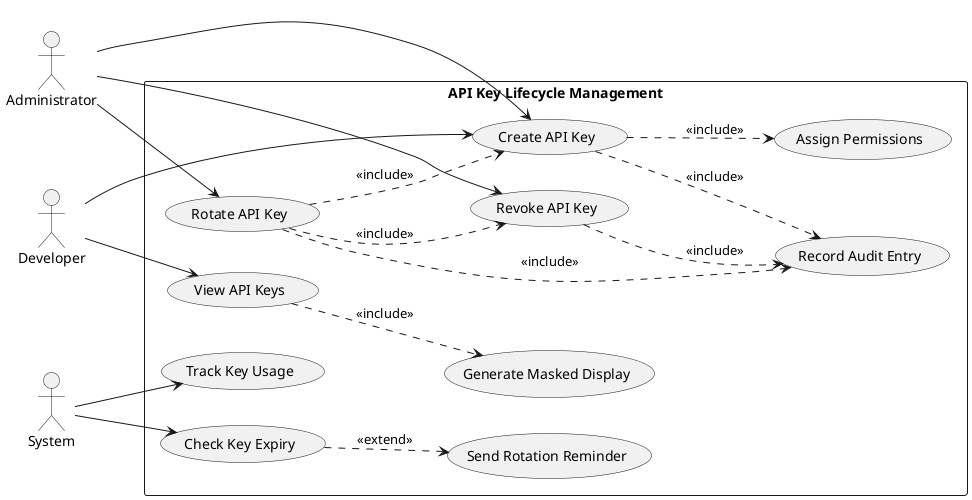
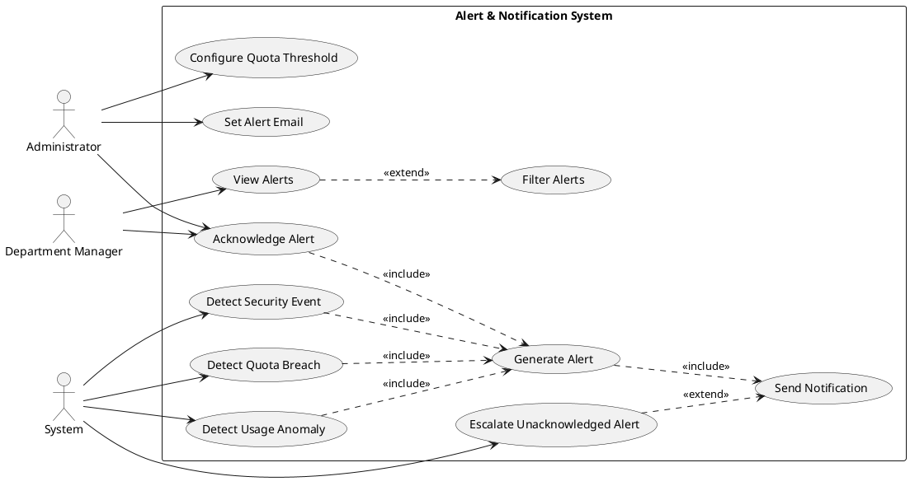
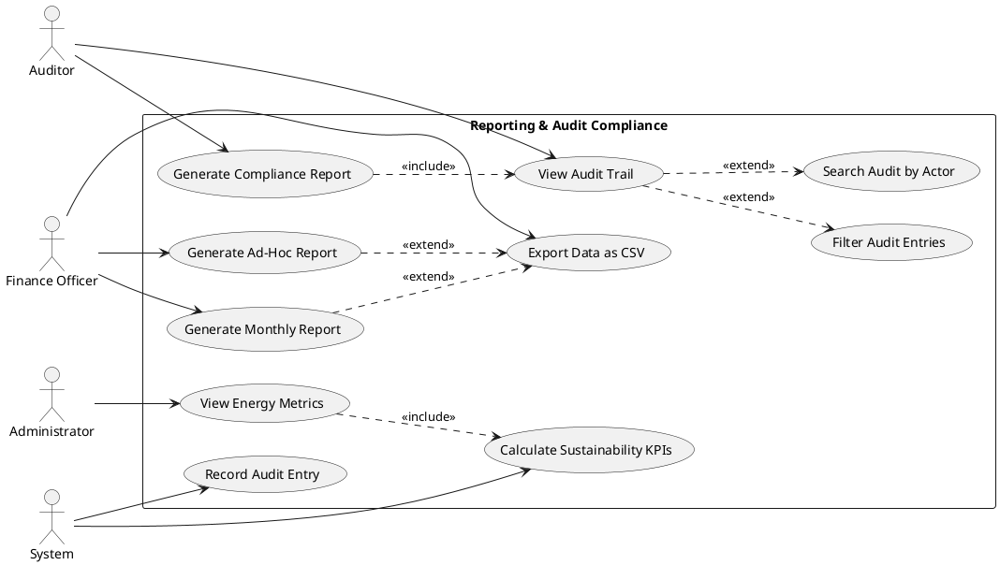
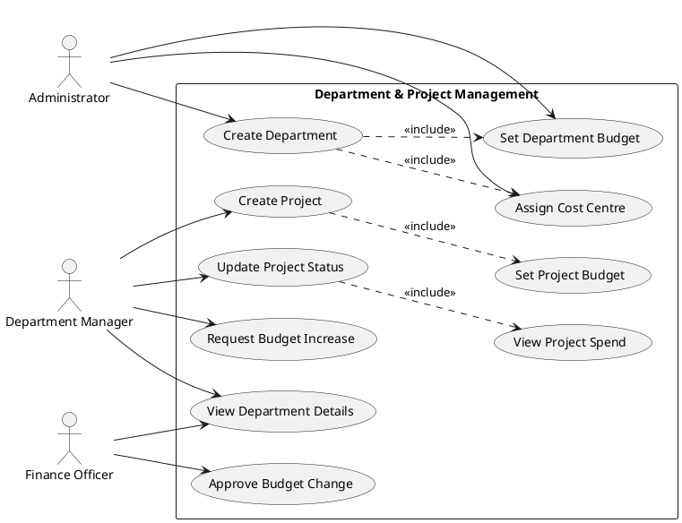
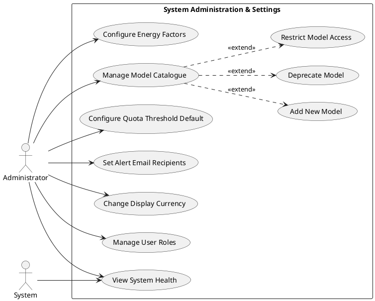

# Use Case Diagrams

## OpenAI Enterprise Billing System — CST2310

---

## 1. Billing and Usage Management

This use case diagram covers the core billing and usage tracking functionality of the system.

**Description:** The Department Manager and Finance Officer access the dashboard to monitor spend and usage. The System actor automatically records API usage events, calculates costs using the model pricing catalogue, and updates budget utilisation. Filtering capabilities extend the usage viewing use case.

---

## 2. API Key Lifecycle Management

This diagram covers the complete lifecycle of API keys from creation through revocation.

**Description:** Administrators and Developers can create API keys (which includes assigning permissions). Administrators can rotate keys (which atomically revokes the old key and creates a new one) and revoke compromised keys. All key lifecycle events are recorded in the audit trail. The System monitors key expiry and sends rotation reminders.

---

## 3. Alert and Notification System

This diagram covers the alert lifecycle from configuration through acknowledgement.

**Description:** The System automatically detects quota breaches, usage anomalies, and security events, generating alerts with appropriate severity levels. Administrators configure thresholds and notification preferences. Department Managers and Administrators can view, filter, and acknowledge alerts. Unacknowledged critical alerts are escalated.

---

## 4. Reporting and Audit Compliance

This diagram covers report generation and audit trail management.

**Description:** Finance Officers generate monthly and ad-hoc reports with optional CSV export. Auditors review the audit trail using filters and search, and can generate compliance reports that include audit trail data. The System records all audit entries and computes sustainability KPIs.

---

## 5. Department and Project Management

This diagram covers organisational structure and budget management.

**Description:** Administrators create departments with budgets and cost centre assignments. Department Managers create projects within their department, manage project status, and request budget increases. Finance Officers approve budget changes and review department details.

---

## 6. System Administration and Settings

This diagram covers system-wide configuration and administration.

**Description:** The Administrator has exclusive access to system configuration, including quota thresholds, email notifications, display currency, user role management, energy calculation factors, and the AI model catalogue. Model management extends to adding, deprecating, and restricting model access.
