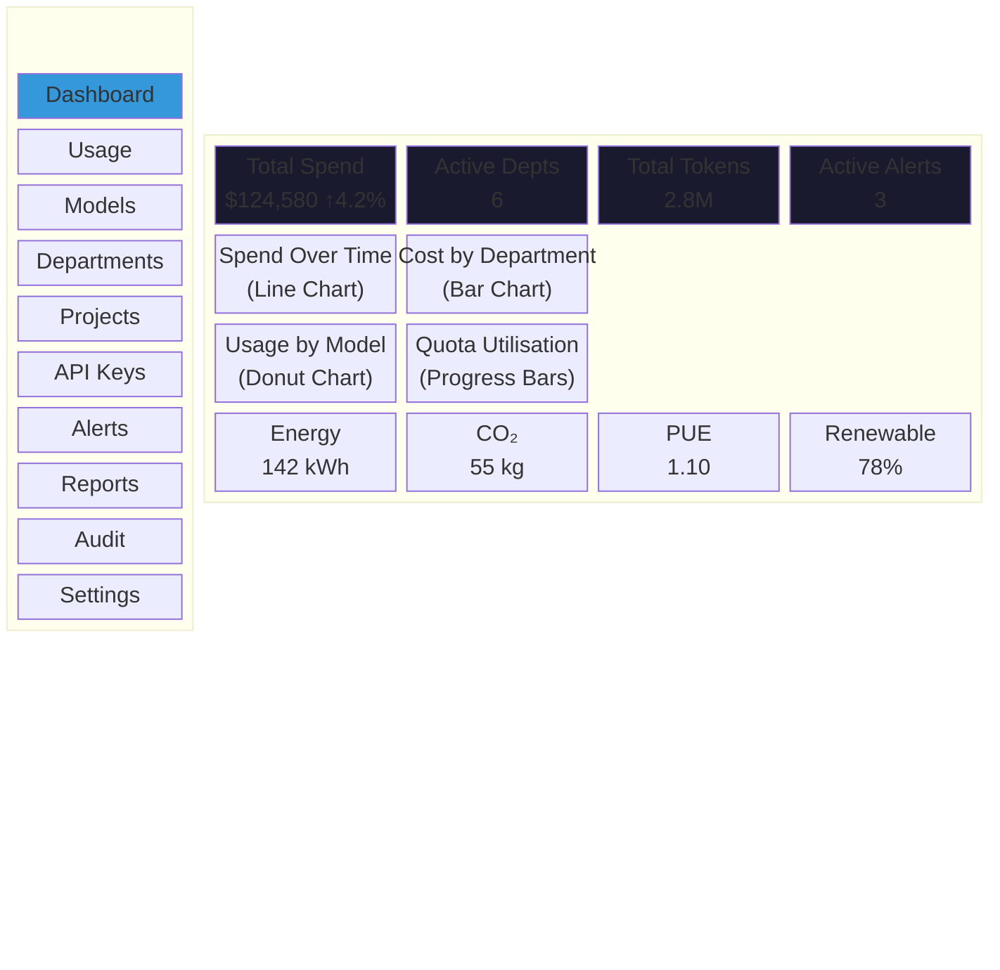
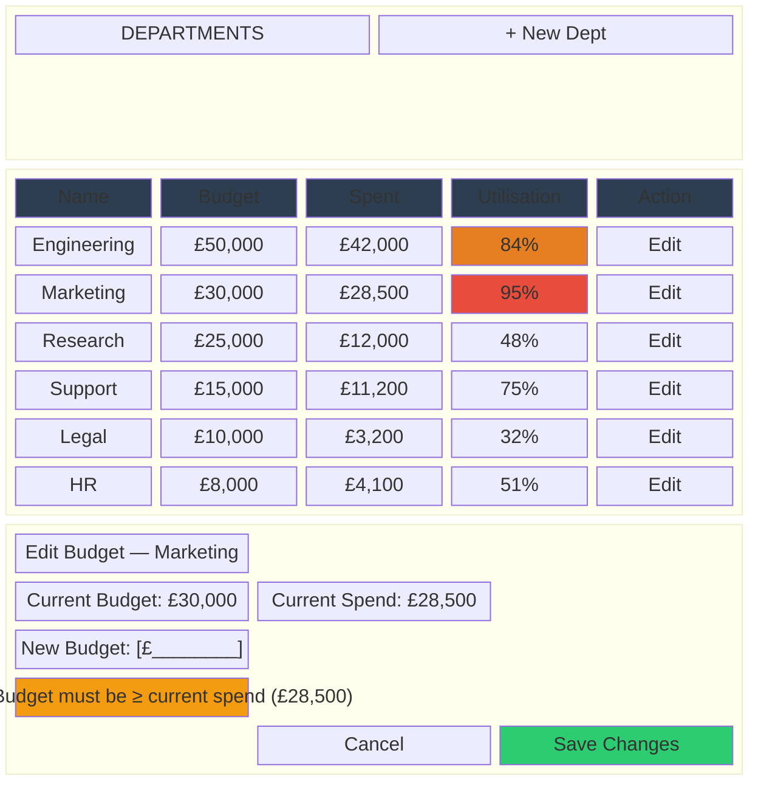
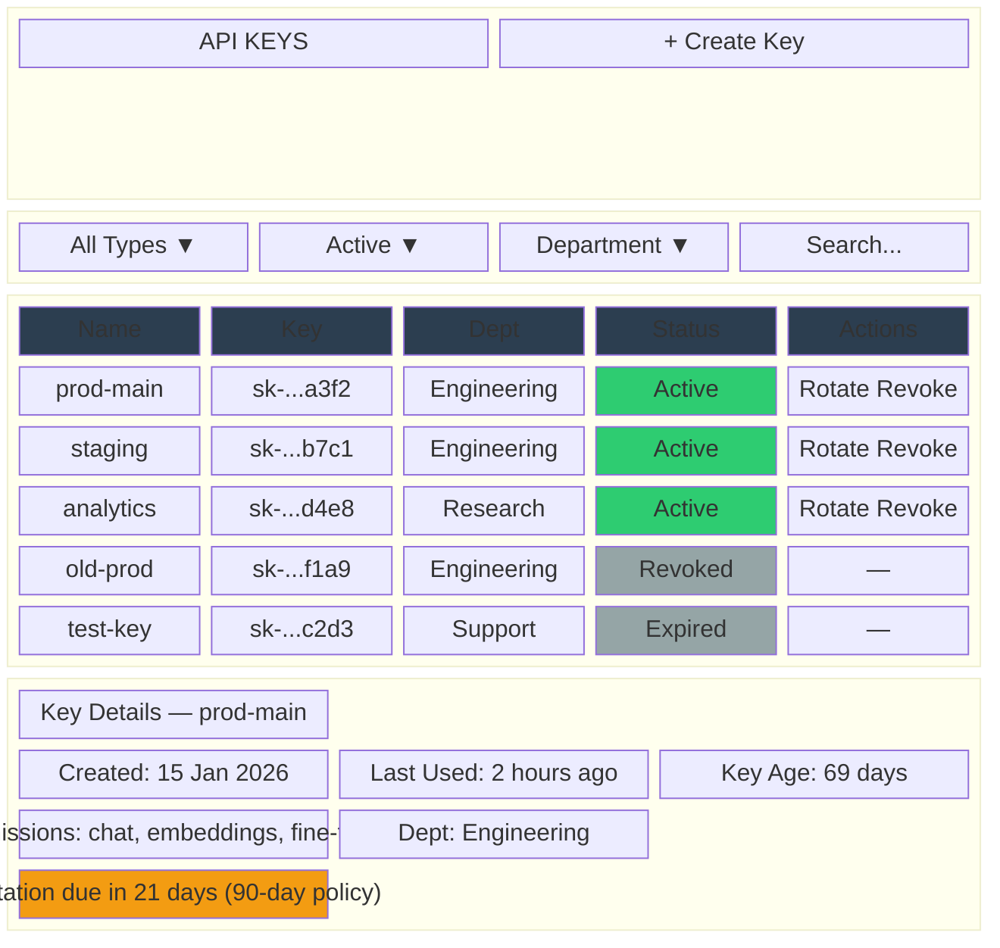
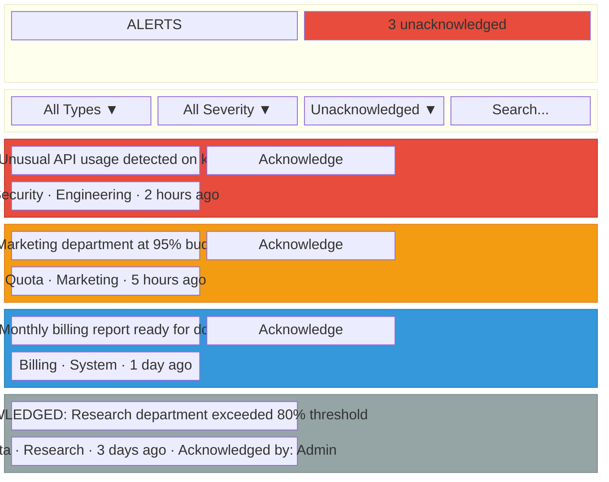
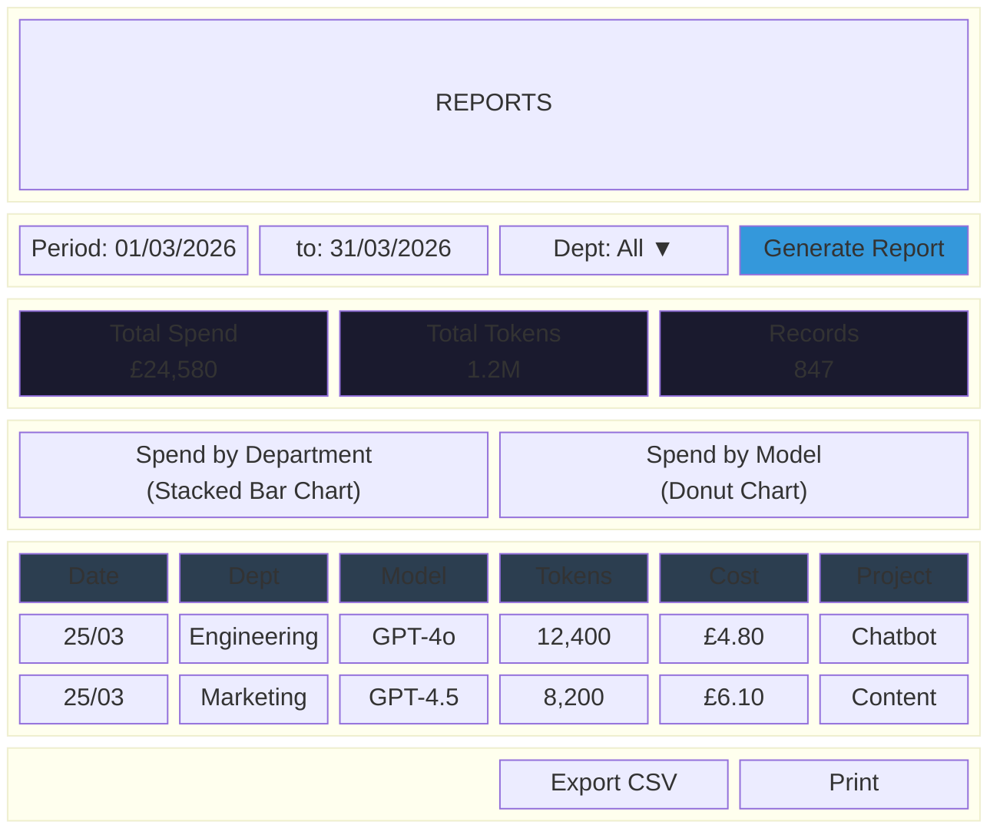
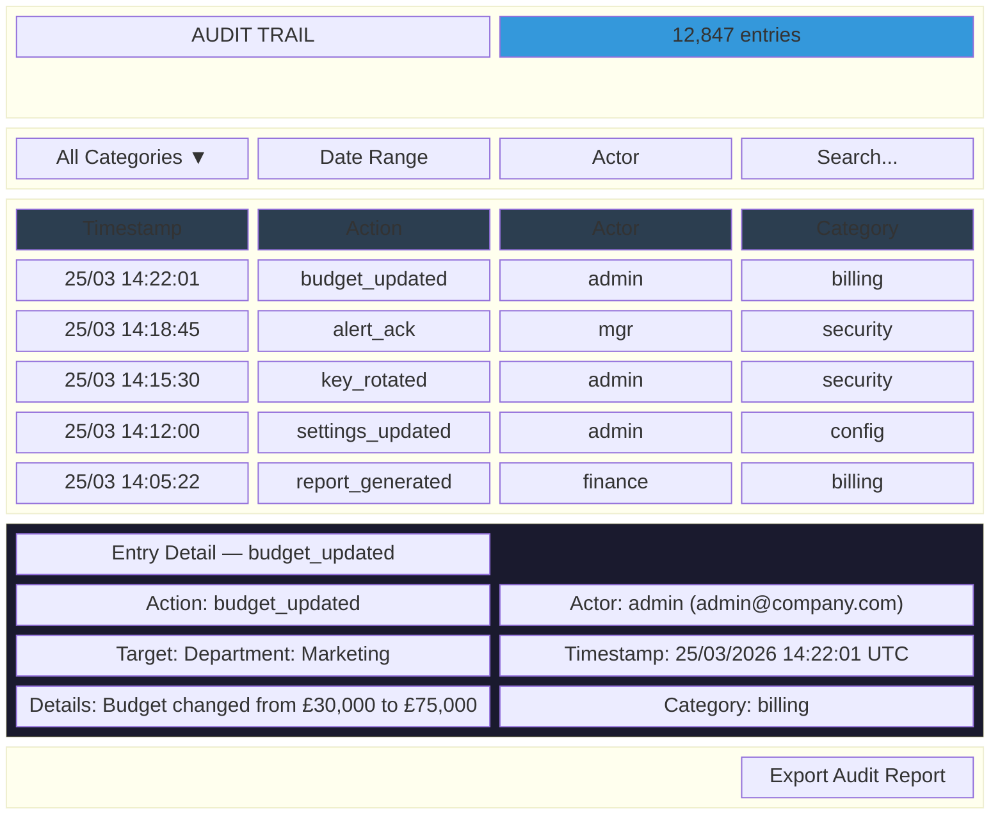

# User Interface Designs

## OpenAI Enterprise Billing System — CST2310

Each UI design is evaluated against Nielsen's 10 Usability Heuristics (Nielsen, 1994).

---

## UI 1: Dashboard Overview

**Purpose:** Provide a real-time at-a-glance summary of enterprise AI spending, usage, and alerts.
**Target Actor:** Department Manager, Finance Officer, Administrator

### Layout Description

### Nielsen's Heuristics Evaluation

| # | Heuristic | Evaluation |
|---|---|---|
| H1 | Visibility of system status | KPI cards update in real time; trend arrows (↑/↓) indicate direction; "X records" badge shows data scope |
| H2 | Match between system and real world | Uses business terminology: "Spend", "Budget", "Tokens", currency symbols; familiar chart types |
| H3 | User control and freedom | Filters can be reset with a single "Reset" button; sidebar navigation allows quick escape to any page |
| H4 | Consistency and standards | All KPI cards follow the same layout (label, value, subtitle, trend); chart colour palette is consistent |
| H5 | Error prevention | Filter dropdowns prevent invalid selections; date picker prevents future dates |
| H6 | Recognition rather than recall | All current values are visible on the dashboard without needing to remember previous data |
| H7 | Flexibility and efficiency of use | Power users can use keyboard shortcuts; date range filter supports presets (Last 7 days, This month, Custom) |
| H8 | Aesthetic and minimalist design | Dark theme reduces visual noise; cards use whitespace; only essential metrics are shown |
| H9 | Help users recognise, diagnose, and recover from errors | If data fails to load, skeleton placeholders are shown with a "Retry" action |
| H10 | Help and documentation | Tooltip on each KPI explains the metric; "?" icon links to documentation |

---

## UI 2: Department Budget Management

**Purpose:** View and manage department budgets with visual spend indicators.
**Target Actor:** Administrator, Finance Officer

### Layout Description

### Nielsen's Heuristics Evaluation

| # | Heuristic | Evaluation |
|---|---|---|
| H1 | Visibility of system status | Progress bars provide immediate visual feedback on budget utilisation; colour coding (green < 70%, amber 70–90%, red > 90%) |
| H2 | Match between system and real world | "Budget", "Spent", "Utilisation" are familiar financial terms; currency symbols match configured locale |
| H3 | User control and freedom | Modal has Cancel button; changes are not saved until explicitly confirmed |
| H4 | Consistency and standards | Table follows standard data grid patterns; Edit button is consistently positioned |
| H5 | Error prevention | Validation prevents setting budget below current spend; inline warning explains constraint |
| H6 | Recognition rather than recall | Current budget and spend are displayed in the modal alongside the input field |
| H7 | Flexibility and efficiency of use | Table columns are sortable; search bar filters departments by name |
| H8 | Aesthetic and minimalist design | Clean table layout; modal focuses on the single edit task without extraneous information |
| H9 | Help users recognise errors | Inline validation message "Budget must be ≥ current spend" appears immediately on invalid input |
| H10 | Help and documentation | Tooltip explains utilisation calculation: "(Spent ÷ Budget) × 100" |

---

## UI 3: API Key Management Console

**Purpose:** Full lifecycle management of API keys: create, view, rotate, revoke.
**Target Actor:** Administrator, Developer

### Layout Description

### Nielsen's Heuristics Evaluation

| # | Heuristic | Evaluation |
|---|---|---|
| H1 | Visibility of system status | Status indicators (●/○/◌) with colour coding; key age and rotation due date visible |
| H2 | Match between system and real world | "Rotate" (⟳) and "Revoke" (✕) icons are universally understood; masked key format matches industry standard |
| H3 | User control and freedom | Confirmation dialog before rotation/revocation; undo not possible for security reasons (clearly stated) |
| H4 | Consistency and standards | Action icons are consistent across all rows; disabled for inactive keys |
| H5 | Error prevention | Rotate/revoke buttons are disabled for already-inactive keys; confirmation required for destructive actions |
| H6 | Recognition rather than recall | Key details panel shows all metadata without requiring navigation to a separate page |
| H7 | Flexibility and efficiency of use | Filters narrow the list; search finds keys by name; bulk operations for administrators |
| H8 | Aesthetic and minimalist design | Only essential columns shown; detail panel appears on selection; inactive keys are visually de-emphasised |
| H9 | Help users recognise errors | "Key rotation due in 21 days" warning provides proactive guidance before the key expires |
| H10 | Help and documentation | Tooltip on permission badges explains each permission scope |

---

## UI 4: Alert Centre

**Purpose:** View, filter, and acknowledge system alerts across all categories and severities.
**Target Actor:** Administrator, Department Manager

### Layout Description

### Nielsen's Heuristics Evaluation

| # | Heuristic | Evaluation |
|---|---|---|
| H1 | Visibility of system status | Badge shows unacknowledged count; alerts sorted by severity (critical first); colour-coded borders |
| H2 | Match between system and real world | Severity icons (⚠/△/ℹ) follow common conventions; "Acknowledge" is clear action language |
| H3 | User control and freedom | Filters allow viewing only relevant alerts; acknowledged alerts remain visible but visually de-emphasised |
| H4 | Consistency and standards | Each alert card follows the same structure: icon, title, metadata, action button |
| H5 | Error prevention | Acknowledge action is a single click (low risk); accidental acknowledgement is acceptable (alert still visible) |
| H6 | Recognition rather than recall | Alert type, department, and time are visible without expanding; no need to remember context |
| H7 | Flexibility and efficiency of use | Keyboard shortcut (A) acknowledges selected alert; filters remember last selection |
| H8 | Aesthetic and minimalist design | Progressive disclosure — minimal info shown, expand for details; acknowledged alerts are greyed |
| H9 | Help users recognise errors | If an alert action fails, an inline retry message appears within the alert card |
| H10 | Help and documentation | "What does this mean?" link on each alert type opens contextual help |

---

## UI 5: Usage Analytics Report

**Purpose:** Generate and explore detailed usage analytics with exportable data.
**Target Actor:** Finance Officer, Department Manager

### Layout Description

### Nielsen's Heuristics Evaluation

| # | Heuristic | Evaluation |
|---|---|---|
| H1 | Visibility of system status | Summary bar shows key totals; loading spinner during report generation; "847 records" confirms scope |
| H2 | Match between system and real world | Date pickers use locale format; currency matches settings; "Export CSV" is standard business terminology |
| H3 | User control and freedom | Filters can be changed and report regenerated; "Reset" clears all filters |
| H4 | Consistency and standards | Chart style and colour palette match the dashboard; table follows same data grid pattern |
| H5 | Error prevention | Date picker prevents end date before start date; model/department dropdowns prevent invalid selections |
| H6 | Recognition rather than recall | Filter selections are visible at the top; summary bar provides context for the detailed data below |
| H7 | Flexibility and efficiency of use | Preset date ranges (This month, Last quarter); table columns are sortable; pagination for large datasets |
| H8 | Aesthetic and minimalist design | Summary → charts → detail table follows information hierarchy; progressive depth |
| H9 | Help users recognise errors | "No data found for selected period" message with suggestion to adjust filters |
| H10 | Help and documentation | Column headers have tooltips explaining the metric |

---

## UI 6: Audit Trail Viewer

**Purpose:** Search, filter, and examine audit log entries for compliance review.
**Target Actor:** Auditor, Administrator

### Layout Description

### Nielsen's Heuristics Evaluation

| # | Heuristic | Evaluation |
|---|---|---|
| H1 | Visibility of system status | Entry count badge; category colour dots; timestamp in readable format |
| H2 | Match between system and real world | "Audit Trail" is standard compliance terminology; actions use clear verbs |
| H3 | User control and freedom | Filters are independently clearable; expanded detail collapses on click; back navigation preserved |
| H4 | Consistency and standards | Category colour coding is consistent across all pages; table follows same pattern |
| H5 | Error prevention | Audit entries are read-only — no accidental modification possible; export is the only write action |
| H6 | Recognition rather than recall | Category dots provide visual identification; entry detail shows all fields in plain language |
| H7 | Flexibility and efficiency of use | Free-text search across all fields; keyboard navigation (↑/↓ to select, Enter to expand) |
| H8 | Aesthetic and minimalist design | Summary table shows essential fields; detail panel appears only on selection |
| H9 | Help users recognise errors | If search returns no results, a message suggests broadening filters |
| H10 | Help and documentation | Category legend is accessible via the filter dropdown; action names link to glossary |

---

## Accessibility Considerations (All UIs)

- **Colour:** All colour-coded indicators have text labels or icon alternatives — never colour alone
- **Contrast:** WCAG 2.1 AA minimum contrast ratio (4.5:1 for normal text, 3:1 for large text) on dark theme
- **Keyboard:** All interactive elements are focusable and operable via keyboard
- **Screen readers:** ARIA labels on all interactive elements; live regions for real-time updates; semantic HTML
- **Motion:** Respects `prefers-reduced-motion` media query; animations can be disabled

---

## References

Nielsen, J. (1994) '10 Usability Heuristics for User Interface Design', *Nielsen Norman Group*. Available at: <https://www.nngroup.com/articles/ten-usability-heuristics/> (Accessed: March 2026).
